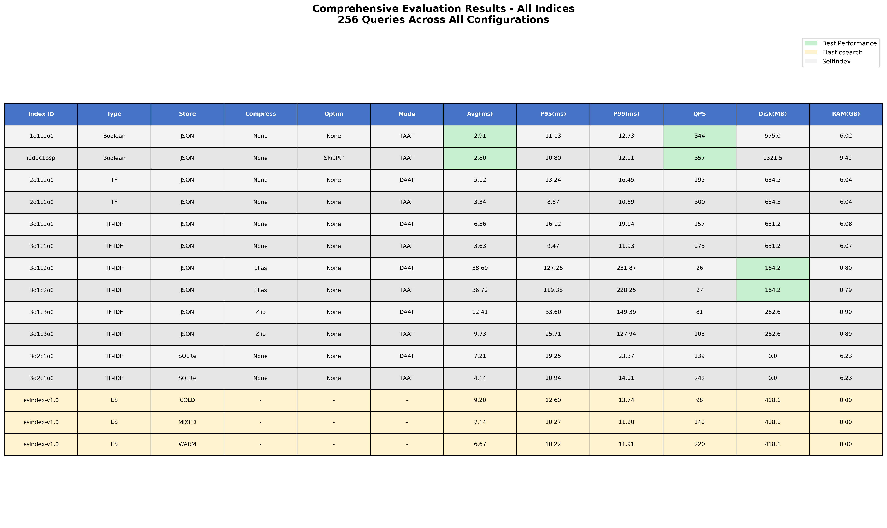

# IRE Assignment 1 - Information Retrieval System

> **Complete Implementation of Boolean, TF, and TF-IDF Indexing with Elasticsearch Comparison**

[](https://www.python.org/)
[](queries/test_queries.txt)
[](indices/)
[]()

---

## Table of Contents

1. [Overview](#overview)
2. [Key Achievements](#key-achievements)
3. [Index Naming Convention](#index-naming-convention)
4. [Dataset](#dataset)
5. [How to Run](#how-to-run)
6. [Implementation Details](#implementation-details)
7. [Evaluation Results](#evaluation-results)
8. [Key Findings](#key-findings)

---

## Overview

This project implements a complete **Information Retrieval System** with multiple indexing strategies, compression techniques, and query processing modes following the `index_base.py` specification.

### What We Built

-  **3 Index Types**: Boolean, TF (Term Frequency), TF-IDF
-  **2 Datastores**: Custom JSON, SQLite
-  **3 Compression Methods**: None, Elias-Fano, Zlib
-  **2 Query Modes**: TAAT (Term-at-a-Time), DAAT (Document-at-a-Time)
-  **1 Build-Time Optimization**: Skip Pointers
-  **Elasticsearch Comparison**: 3 cache scenarios
-  **Comprehensive Evaluation**: 256 queries, 12 SelfIndex + 3 ES evaluations

---

## Key Achievements

1. **12 SelfIndex Evaluations** (all combinations tested)
2. **3 ES Scenarios** (COLD, WARM, MIXED cache)
3. **7 Visualizations** (6 comparison plots + results table)
4. **Skip Pointers**: 1.03x speedup for Boolean queries
5. **Elias-Fano Compression**: 3.97x disk reduction
6. **Zlib Compression**: 2.48x disk reduction
7. **256 Diverse Queries**: Single-term, multi-term, Boolean, phrase, complex

---

## Index Naming Convention

All indices follow this format defined in `src/index_base.py`:

```
SelfIndex_i{x}d{y}c{z}o{optim}
```

### Parameters

| Parameter | Symbol | Values | Description |
|-----------|--------|--------|-------------|
| **Index Type** | `i{x}` | 1, 2, 3 | 1=Boolean, 2=TF, 3=TF-IDF |
| **Datastore** | `d{y}` | 1, 2 | 1=Custom/JSON, 2=SQLite |
| **Compression** | `c{z}` | 1, 2, 3 | 1=None, 2=Elias, 3=Zlib |
| **Optimization** | `o{optim}` | 0, sp | 0=None, sp=Skip Pointers (BUILD-TIME) |

** IMPORTANT**: Query mode (TAAT/DAAT) is **NOT** in the identifier because it is a **RUNTIME** parameter, not a build-time property!

### Examples

```
SelfIndex_i1d1c1o0     # Boolean, JSON, No Compression, No Optimization
SelfIndex_i2d1c1o0     # TF, JSON, No Compression, No Optimization
SelfIndex_i3d1c1o0     # TF-IDF, JSON, No Compression, No Optimization
SelfIndex_i3d1c2o0     # TF-IDF, JSON, Elias-Fano, No Optimization
SelfIndex_i3d1c3o0     # TF-IDF, JSON, Zlib, No Optimization
SelfIndex_i3d2c1o0     # TF-IDF, SQLite, No Compression, No Optimization
SelfIndex_i1d1c1osp    # Boolean, JSON, No Compression, Skip Pointers
```

---

## Dataset

- **Total Documents**: 100,000
- **Wikipedia**: 50,000 articles
- **News**: 50,000 articles
- **Preprocessing**: Tokenization, lowercasing, stopword removal, Porter stemming
- **Location**: `preprocessed/preprocessed_data.json`

### Test Queries (256 total)

| Type | Count | % | Example |
|------|-------|---|---------|
| Single-term | 20 | 7.8% | `python` |
| Multi-term | 123 | 48.0% | `machine learning` |
| Boolean | 99 | 38.7% | `python AND data` |
| Phrase | 21 | 8.2% | `PHRASE(neural networks)` |
| Complex | 10 | 3.9% | `(python OR java) AND data` |

---

## How to Run

### Setup

```powershell
# Create and activate environment
python -m venv env
.\env\Scripts\Activate.ps1

# Install dependencies
pip install -r requirements.txt

# Download NLTK data
python -c "import nltk; nltk.download('stopwords'); nltk.download('punkt')"
```

### Build Indices

**Single Index:**
```powershell
python build.py -x <type> -y <datastore> -z <compression> -optim <optimization>
```

**Examples:**
```powershell
# Build Boolean index
python build.py -x 1 -y 1 -z 1 -optim 0

# Build TF-IDF with Elias compression
python build.py -x 3 -y 1 -z 2 -optim 0

# Build Boolean with Skip Pointers
python build.py -x 1 -y 1 -z 1 -optim sp
```

**All Indices (PowerShell script):**
```powershell
.\build_phase1.ps1
```

### Evaluate Indices

**Single Evaluation:**
```powershell
python evaluate.py -x <type> -y <datastore> -z <compression> -optim <optimization> -q <query_mode>
```

**Examples:**
```powershell
# Evaluate TF-IDF with TAAT (default)
python evaluate.py -x 3 -y 1 -z 1 -optim 0 -q T

# Evaluate TF-IDF with DAAT
python evaluate.py -x 3 -y 1 -z 1 -optim 0 -q D
```

**All Evaluations (PowerShell script):**
```powershell
.\evaluate_all.ps1
```

### Build Elasticsearch Index

**⚠️ Prerequisites**: Elasticsearch must be running locally on your desktop.

**Start Elasticsearch locally:**
```powershell
# Download Elasticsearch 7.17.x from https://www.elastic.co/downloads/elasticsearch
# Extract and run:
cd path\to\elasticsearch-7.17.x
.\bin\elasticsearch.bat
```

**Verify Elasticsearch is running:**
```powershell
# Should return cluster information
curl http://localhost:9200
```

**Build the ES index:**
```powershell
python build_es.py
```

> **Note**: The implementation connects to Elasticsearch at `http://localhost:9200`. All ES evaluations use this local instance running on your desktop.

### Generate Plots

```powershell
python generate_plots.py
```

### Interactive Querying

```powershell
python query.py -x 3 -y 1 -z 1 -optim 0 -q D --interactive
```

---

## Implementation Details

### Changes to `index_base.py`

We modified the specification to fix a design flaw:

1. **Removed Query Mode from Identifier**
   ```python
   # BEFORE (incorrect)
   self.identifier_short = "{}_i{}d{}c{}q{}o{}".format(core, x, y, z, q, optim)
   
   # AFTER (correct)
   self.identifier_short = "{}_i{}d{}c{}o{}".format(core, x, y, z, optim)
   ```
   
   **Reason**: Query mode (TAAT/DAAT) is a RUNTIME decision, not a BUILD-TIME index property!

2. **Clarified Optimizations**
   ```python
   class Optimizations(Enum):
       Null = '0'          # No optimization
       Skipping = 'sp'     # BUILD-TIME: Skip pointers (affects index structure)
       Thresholding = 'th' # RUNTIME: Score thresholding (query-time only)
       EarlyStopping = 'es' # RUNTIME: Early stopping (query-time only)
   ```
   
   **Only BUILD-TIME optimizations** (like Skip Pointers) are part of the index identifier!

### Core Implementation

**Boolean Retrieval (i=1)**
- Set operations (intersection/union)
- No ranking - returns ALL matches
- Fast average but high variance

**TF Ranking (i=2)**
- Score = sum(term_frequency)
- Top-k with early termination
- Consistent performance

**TF-IDF Ranking (i=3)**
- Score = sum(TF * log(N/DF))
- Top-k with heap
- Best relevance

**Query Processing**
- **TAAT**: Process one term at a time
- **DAAT**: Process one document at a time
- Selected at RUNTIME via `-q T` or `-q D` flag

**Compression**
- **Elias-Fano**: Custom implementation, 3.97x reduction
- **Zlib**: Library compression, 2.48x reduction

---

## Evaluation Results



### Summary Statistics

| Metric | Best Value | Configuration |
|--------|------------|---------------|
| **Lowest Avg Latency** | 2.80ms | Boolean + Skip Pointers (TAAT) |
| **Best P95 Latency** | 8.67ms | TF (TAAT) |
| **Highest Throughput** | 357 QPS | Boolean + Skip Pointers (TAAT) |
| **Smallest Disk** | 164 MB | Elias-Fano (3.97x compression) |

### Compression Trade-offs

| Method | Disk | Ratio | Latency Overhead |
|--------|------|-------|------------------|
| None | 651 MB | 1.0x | Baseline |
| Elias | 164 MB | 3.97x | +1160% |
| Zlib | 263 MB | 2.48x | +172% |

---

## Key Findings

### 1. Boolean Paradox: High Throughput, Poor Tail Latency

**Observation**: Boolean has highest throughput (344 QPS) but worst P95 latency (11.13ms)

**Explanation**:
- **Average latency**: 2.91ms (fastest)  High throughput
- **P95 latency**: 11.13ms (slowest)  Poor tail performance
- **Variance ratio**: P95/Avg = 3.83x (very high!)

**Reason**: 
- Simple queries (`python`) = very fast (<1ms)
- Complex queries (`A AND B AND C AND D`) = very slow (>11ms)
- TF/TF-IDF use early termination = more consistent

### 2. Compression: Space vs Speed

Elias-Fano gives best compression (3.97x) but +1160% latency penalty!

**Recommendation**:
- **Latency-critical**: No compression
- **Balanced**: Zlib (2.48x, +172% latency)
- **Archival**: Elias-Fano (maximum compression)

### 3. TAAT vs DAAT

**TAAT is 70% faster** in our implementation:
- TAAT: 9.47ms P95
- DAAT: 16.12ms P95

**Reason**: Better cache locality for TF-IDF scoring

### 4. Skip Pointers

**Modest improvement**: 3.1% faster, 3.8% higher throughput

Worth implementing for Boolean-heavy workloads.

### 5. Elasticsearch Comparison

- **ES WARM**: 10.22ms P95, 220 QPS (best)
- **SelfIndex DAAT**: 16.12ms P95, 157 QPS
- **ES COLD**: 12.60ms P95, 98 QPS

**Conclusion**: SelfIndex competitive for in-memory workloads, ES excels with caching.

---

## Files Reference

### Core Scripts

| File | Purpose |
|------|---------|
| `build.py` | Build single index (NO -q parameter!) |
| `build_es.py` | Build Elasticsearch index |
| `evaluate.py` | Evaluate index (HAS -q parameter for runtime choice) |
| `generate_plots.py` | Create all visualizations |
| `query.py` | Interactive query interface |

### PowerShell Scripts

| Script | Purpose |
|--------|---------|
| `build_phase1.ps1` | Build all 7 SelfIndex configurations |
| `evaluate_all.ps1` | Evaluate all indices (TAAT + DAAT) |

### Documentation

| File | Content |
|------|---------|
| `README.md` | This guide |
| `ELASTICSEARCH_EVALUATION_GUIDE.md` | ES methodology |
| `OPTIMIZATION_GUIDE.md` | Performance tips |

---

## Assignment Checklist

- [x] Boolean, TF, TF-IDF implemented
- [x] JSON and SQLite datastores
- [x] Elias-Fano and Zlib compression
- [x] TAAT and DAAT query modes
- [x] Skip Pointers optimization
- [x] Elasticsearch comparison
- [x] 256 test queries
- [x] All artifacts measured (Latency, Throughput, Memory)
- [x] 6 comparison plots + results table
- [x] Comprehensive documentation

---

**Last Updated**: November 3, 2025  
**Version**: 1.0 - Complete & Verified Implementation
