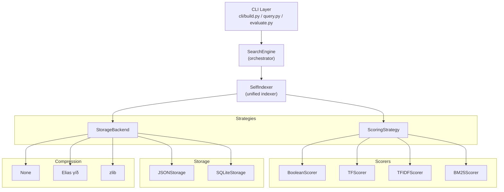
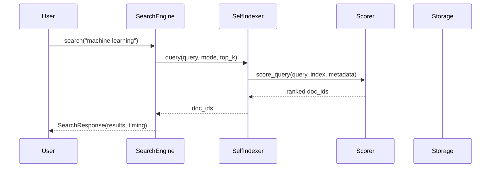

# Architecture Overview

The IRE Search Engine uses the **Strategy Pattern** to compose any combination of scoring, storage, and compression at runtime.

## System Diagram



## Key Components

| Component | File | Purpose |
|-----------|------|---------|
| `SelfIndexer` | [core/indexer.py](../src/ire_search/core/indexer.py) | Unified indexer composing scorer + storage |
| `create_indexer()` | [core/indexer.py](../src/ire_search/core/indexer.py) | Factory replacing ad-hoc construction |
| `ScoringStrategy` | [scoring/strategies.py](../src/ire_search/scoring/strategies.py) | ABC for Boolean/TF/TF-IDF/BM25 |
| `StorageBackend` | [storage/backends.py](../src/ire_search/storage/backends.py) | ABC for JSON/SQLite with compression |
| `SearchEngine` | [core/engine.py](../src/ire_search/core/engine.py) | High-level orchestrator with structured results |

## Data Flow



## Configuration Space

**24 valid combinations** via `create_indexer(x, y, z)`:

| Parameter | Values | Description |
|-----------|--------|-------------|
| `x` (scorer) | 1=Boolean, 2=TF, 3=TF-IDF, 4=BM25 | Ranking algorithm |
| `y` (storage) | 1=JSON, 2=SQLite | Persistence backend |
| `z` (compression) | 1=None, 2=Elias, 3=zlib | Index compression |

Identifier format: `SelfIndex_i{x}d{y}c{z}o{optim}`

## Local semantic search (parallel track)

Lexical `SelfIndexer` is unchanged. Optional **vector** search lives under [`integrations/chroma_local/`](../src/ire_search/integrations/chroma_local/):

- **`LocalIndexer`** — `chromadb.PersistentClient` under `.chroma_db/`, `SentenceTransformer("all-MiniLM-L6-v2")`, `add_documents` / `search` / `reset`.
- **`file_crawler`** — [`core/file_crawler.py`](../src/ire_search/core/file_crawler.py) walks a directory and extracts text from PDF / Office / Markdown.


## Directory Structure

```
IRE_Assignment1/
├── main.py               # Optional entrypoint → cli/
├── cli/
│   ├── build.py          # Build indices
│   ├── query.py          # Query interface
│   ├── evaluate.py       # Performance evaluation
│   └── generate_plots.py # Visualization
├── src/ire_search/       # Installable Python package
│   ├── core/             # SelfIndexer, SearchEngine, preprocessor
│   ├── scoring/          # Strategy implementations
│   ├── storage/          # JSON / SQLite backends
│   ├── compression/      # Elias + zlib
│   ├── io/               # data_loader (Parquet, news ZIPs)
│   ├── evaluation/       # MetricsCollector
│   └── integrations/chroma_local/
├── tests/                # pytest suite
├── docs/                 # This documentation
├── indices/              # Built index files
└── results/              # Evaluation JSON results
```
